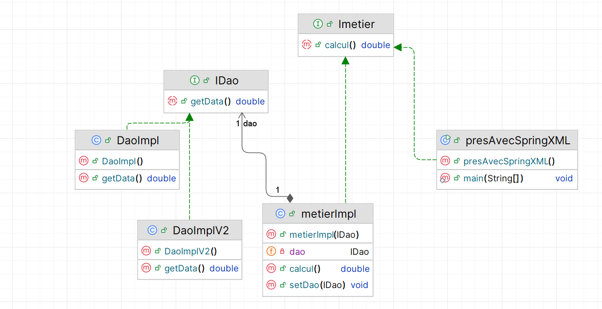
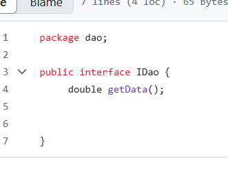
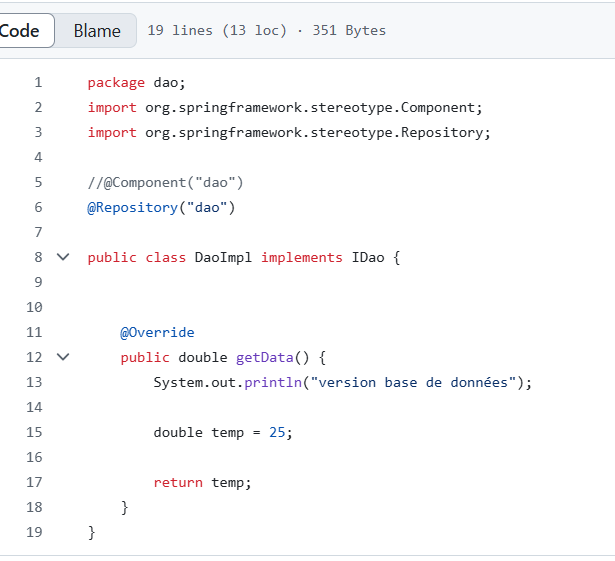
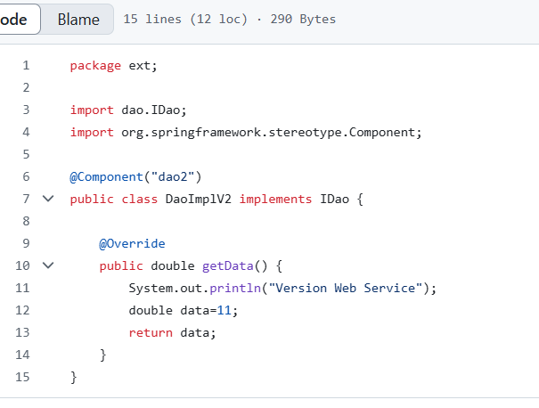
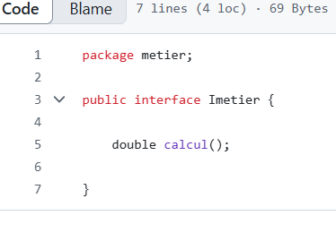
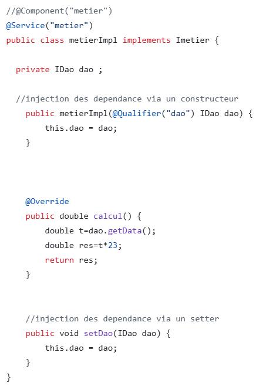
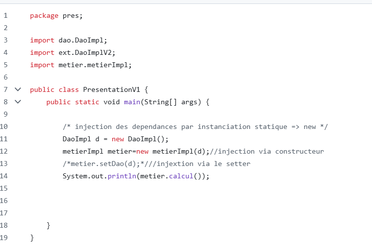
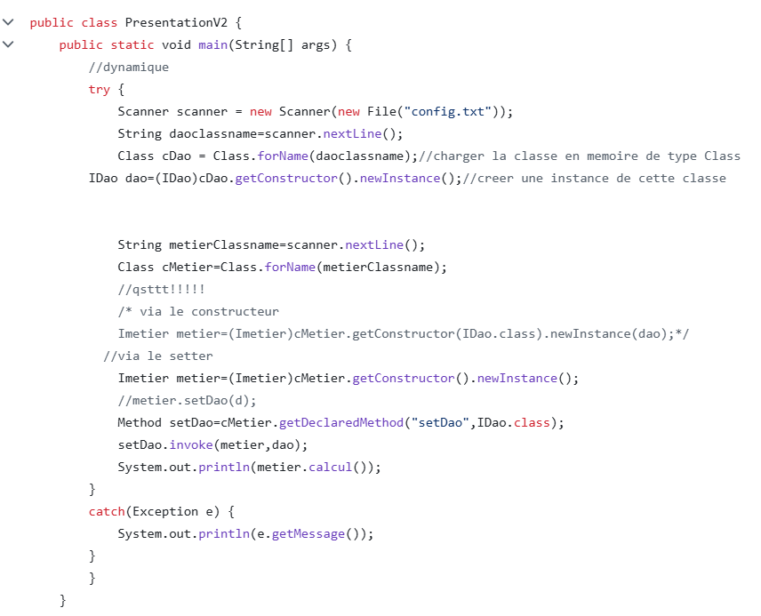
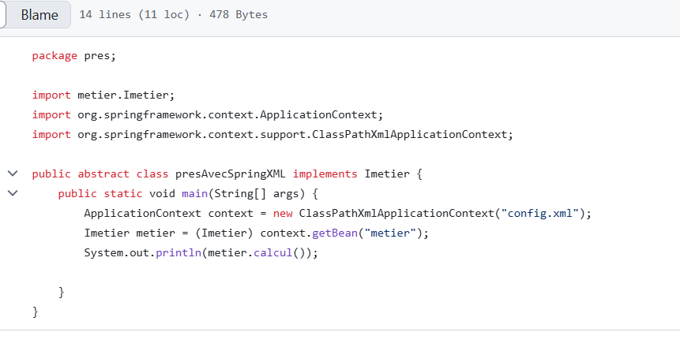
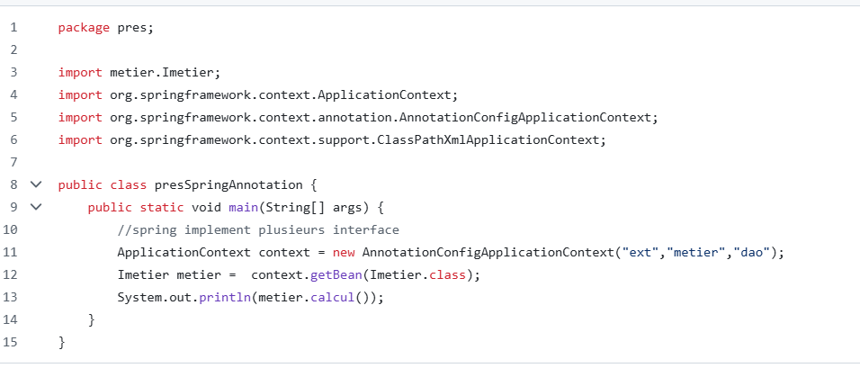

<h2>Injection des dépendances et inversion de controle</h2>
<h5>voici le diagramme de classe </h5>

 Créer l'interface IDao avec une méthode getData 

faire l'implementation version base de données

faire l'implementation version web service

 Créer l'interface IMetier avec une méthode calcul

Faire l'injection des dépendances :

Par instanciation statique

Par instanciation dynamique

En utilisant le Framework Spring Version XML

n utilisant le Framework Spring Version annotations

